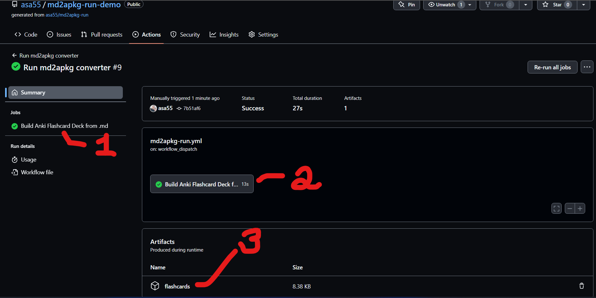
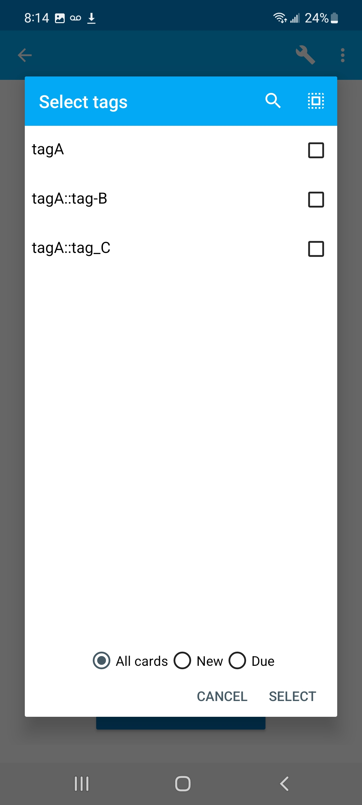
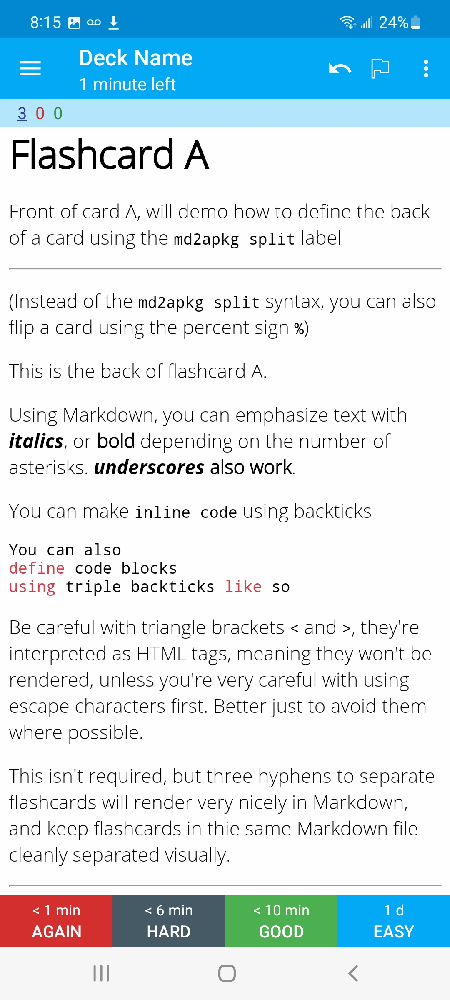
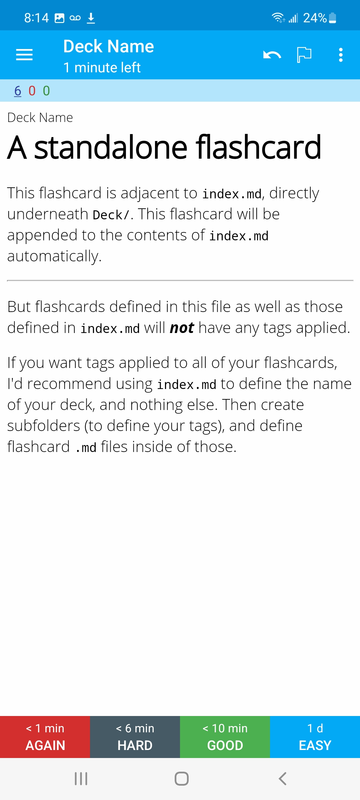
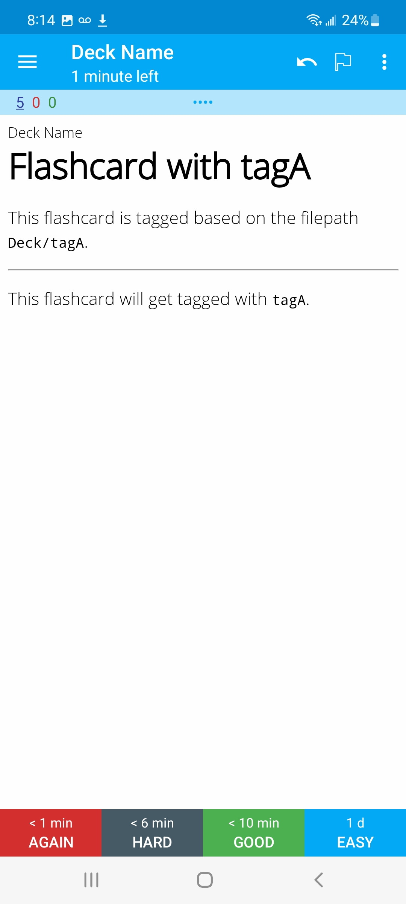
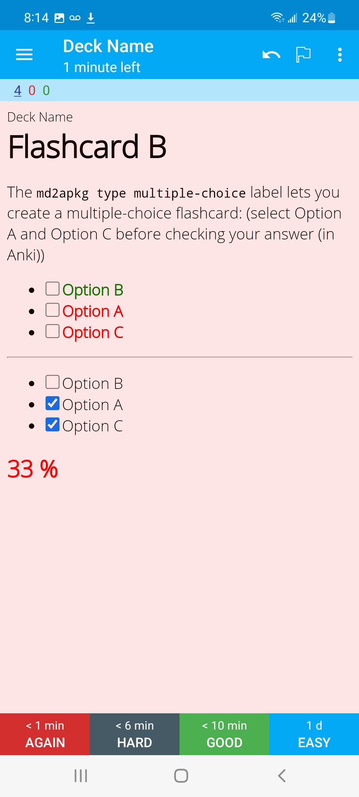
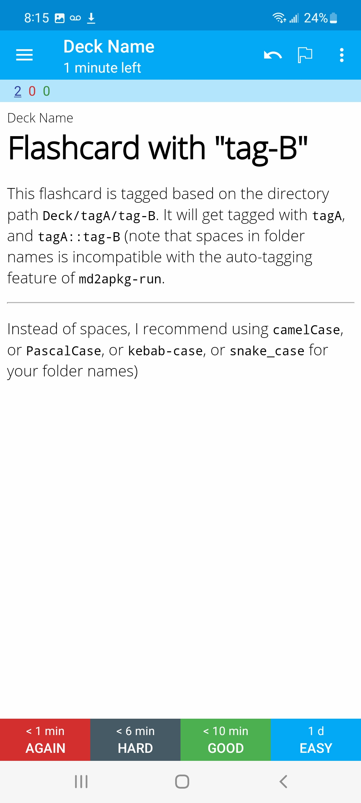
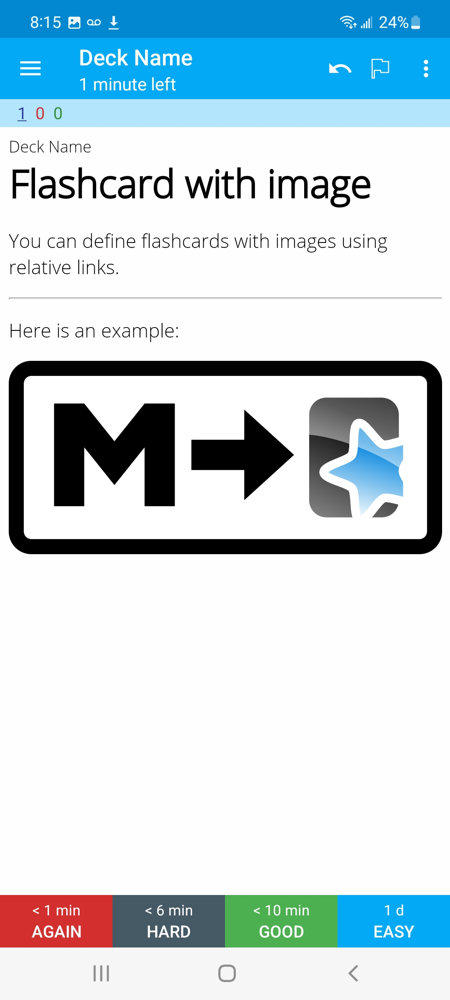

# md2apkg-run-demo

This code implements the Quickstart Guide laid out in [`md2apkg-run`](https://github.com/asa55/md2apkg-run), and demonstrates that project's core features.

The quickstart instructions instruct you how use `md2apkg-run` to build Anki-compatible `.apkg` flashcard decks.

You can use `md2apkg-run` or `md2apkg-run-demo` as a template from which to build your own Anki-compatible flashcard decks.

So give the quickstart a try, pull the resulting flashcard deck into Anki, and compare it to the `.md` files you see in this repo.

# Output

